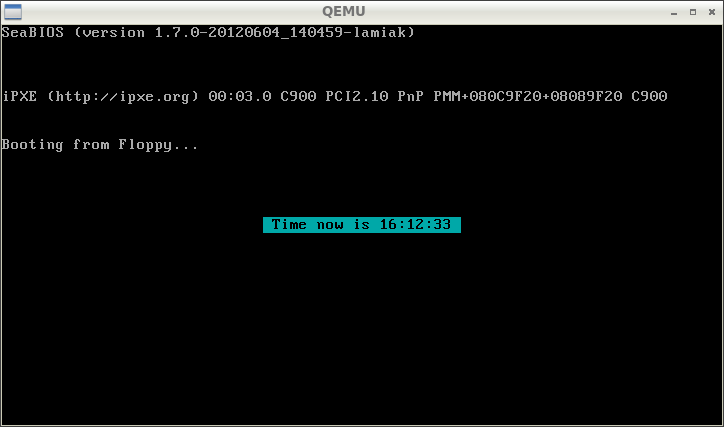

# CS630 on Qemu in Ubuntu

- Author: Wu Zhangjin/Falcon <wuzhangjin@gmail.com> of [TinyLab.org](http://tinylab.org)
- Update: 2008-09-16, 2014/03/16, 2016/08/04
- Home: <http://www.tinylab.org/cs630-qemu-lab/>
- Repo: <http://github.com/tinyclub/cs630-qemu-lab.git>
- CS630: <http://www.cs.usfca.edu/~cruse/cs630f06/>

## Prepare

    $ git clone https://github.com/tinyclub/cloud-lab.git

    $ cd cloud-lab/ && tools/docker/choose cs630-qemu-lab

    $ tools/docker/pull         # Pull from docker hub
    $ tools/docker/run

Login the noVNC website with the printed password and launch the lab via the
desktop shortcut.

## Update

A backup of the cs630 exercises has been downloaded in `res/`, update it with:

    $ make update

## Usage

Bascially, please type:

    $ make help

### Configure a source

For example, to compile the src/helloworld.s, configure it with:

    $ ./configure src/helloworld.s

To compile the assembly files from res/, use rtcdemo.s as an example, just
type:

    $ ./configure res/rtcdemo.s

### Compile and Boot

Some examples can be compiled for **Real mode**, some others need to be
compiled for **Protected mode**.

To boot with curses based graphic (console friendly), please pass 'G=0' to
make, exit with 'ESC' + '2' to Qemu monitor console and the 'quit' command.

    $ make boot G=0

Or with `SRC` to configure together:

    $ make boot SRC=src/rtc.s
    $ make pmboot SRC=res/rtcdemo.s // make boot PM=1 SRC=res/rtcdemo.s

Or

    $ make boot S=src/rtc.s
    $ make pmboot S=res/rtcdemo.s

To debug with it, in one terminal:

    $ make boot D=1

In another:

    $ gdb boot.o
    (gdb) target remote :1234
    (gdb) b start
    (gdb) b getRTC
    (gdb) b printTime

#### **Real mode** exercise

- helloworld

        $ make boot SRC=src/helloworld.s

- rtc

        $ make boot SRC=src/rtc.s

#### **Protected mode** exercise

- helloworld

        $ make pmboot SRC=src/pmhello.s

- rtc

        $ make pmboot SRC=src/pmrtc.s

## NOTES

In fact, some exercises not about "protected mode" also need to use the
2nd method to compile, for they begin execution with `CS:IP = 1000:0002`, and
need a "bootloader" to load them, or their size are more than 512 bytes, can
not be put in the first 512bytes of the disk (MBR).

See more notes from NOTE.md:

    $ make note
